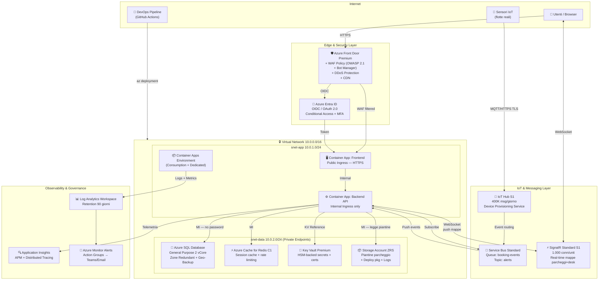

# Architettura Enterprise — Spotly

> **Obiettivo:** Infrastruttura production-grade, scalabile, sicura, multi-tenant, zero-trust network, SLA 99.9%+.

---

## Diagramma architetturale



---

## Componenti

| Layer | Risorsa | SKU | Scopo |
|-------|---------|-----|-------|
| **Edge** | Azure Front Door Premium | Premium | Entry point, WAF, CDN, DDoS |
| **Auth** | Azure Entra ID | P1/P2 | OIDC, Conditional Access, MFA |
| **Compute** | Container Apps | Consumption + Dedicated | Frontend + Backend API, autoscaling |
| **IoT** | Azure IoT Hub | S1 Standard | Ingestion sensori, 400K msg/giorno |
| **Messaging** | Service Bus | Standard | Disaccoppiamento IoT → Backend |
| **Database** | Azure SQL Database | GP 2 vCore, Zone Redundant | Dati operativi, storico, SLA 99.99% |
| **Cache** | Azure Cache for Redis | C1 | Session state, real-time parking status |
| **Real-time** | Azure SignalR Service | Standard S1 | Aggiornamenti real-time mappe parcheggi + postazioni (< 1s) |
| **Storage** | Storage Account ZRS | Zone Redundant | Piantine parcheggi **e** postazioni, deploy pkg, log audit |
| **Secrets** | Key Vault Premium | HSM | Secrets, certificati TLS, chiavi IoT |
| **Network** | VNet + Private Endpoints | — | Zero-trust network, no internet per dati |
| **Monitoring** | Log Analytics + App Insights | PerGB2018 | Osservabilità full-stack |

---

## Sicurezza — Zero Trust model

### Perimetro di rete
```
Internet → Front Door (WAF) → VNet (privato)
                                   ↓
                           Container Apps (solo tramite AFD)
                                   ↓
                    SQL / Redis / KV (solo via Private Endpoint)
                    — NESSUN accesso pubblico ai data store —
```

### Identità e accessi
| Risorsa | Come accede | Credenziali |
|---------|-------------|-------------|
| Container App → SQL | Managed Identity | Nessuna password |
| Container App → Key Vault | Managed Identity + RBAC | Nessuna password |
| Container App → Service Bus | Managed Identity | Nessuna password |
| IoT Devices → IoT Hub | Device certificate (X.509) o SAS key in KV | Gestita da DPS |
| Utenti → Web App | Entra ID OIDC + MFA | Token JWT, scadenza 1h |
| DevOps → Azure | Service Principal (Workload Identity Federation) | Nessun secret |

### WAF Policy (Front Door)
- **OWASP Core Rule Set 2.1** — Protection da SQL Injection, XSS, ecc.
- **Bot Manager Rule Set 1.0** — Blocco bot malevoli
- **Modalità: Prevention** (blocco diretto, non solo log)
- **Rate Limiting** custom per endpoint API

---

## Scalabilità

### Container Apps — Scale Rules
```yaml
# Backend API: scala su richieste HTTP concorrenti
scale:
  minReplicas: 1
  maxReplicas: 20
  rules:
    - http: concurrentRequests: 100   # +1 replica ogni 100 req concorrenti

# Frontend: scala su CPU/Memory
scale:
  minReplicas: 1
  maxReplicas: 10
  rules:
    - http: concurrentRequests: 50
```

### Azure SQL — Alta Disponibilità
- **Zone Redundant**: replica sincrona su 3 availability zones
- **Geo-backup**: backup automatico su storage LRS/GRS
- **Read replica** (opzionale): letture analytics su replica secondaria

---

## Osservabilità

| Segnale | Tool | Retention |
|---------|------|-----------|
| Logs applicativi | Log Analytics | 90 giorni |
| Metriche infra | Azure Monitor | 93 giorni |
| Distributed tracing | Application Insights | 90 giorni |
| Audit log Entra ID | Log Analytics | 30 giorni |
| Alert | Monitor + Action Group | — |

### Alert configurati
- CPU Container App > 80% per 5 min → Scale out + notifica
- SQL DTU > 90% → Notifica DBA
- IoT Hub: drop messaggi → Notifica on-call
- Key Vault: accessi anomali → Alert sicurezza

---

## Disaster Recovery

| Scenario | RTO | RPO | Soluzione |
|----------|-----|-----|-----------|
| Container App crash | < 1 min | 0 | Auto-restart + min 1 replica |
| SQL AZ failure | < 30 sec | 0 | Zone Redundant (sincrono) |
| Region failure | < 4 ore | < 1 ora | Geo-backup + re-deploy Bicep |
| Key Vault deletion | Soft delete 90 gg | 0 | Purge protection abilitata |
