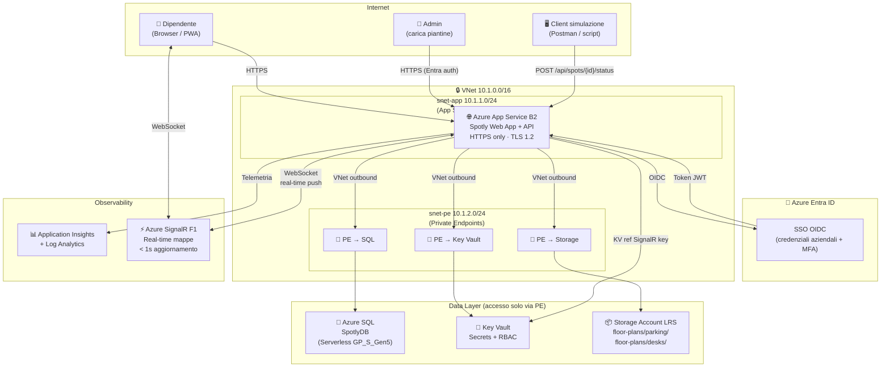

# Architettura POC — Spotly

> **Obiettivo:** Infrastruttura sicura e funzionante per i 3 moduli Spotly (parcheggio, postazioni, pranzo), deployabile in < 30 min su Azure.
> Stato delle risorse aggiornato via **API REST** (simulazione) e propagato in real-time via **SignalR**.
> Rete privata con **VNet Integration** e **Private Endpoints** su tutti i data store.

---

## Diagramma architetturale



---

## Componenti

| Risorsa | SKU | Scopo |
|---------|-----|-------|
| **App Service Plan** | B2 (2 vCore, 3.5 GB) | Hosting Spotly Web App + API |
| **Azure App Service** | — | SSO Entra ID Easy Auth, 3 moduli Spotly |
| **Azure SQL Database** | Serverless GP_S_Gen5 | SpotlyDB — prenotazioni, risorse, policy |
| **Azure SignalR** | Free F1 (20 conn, 20K msg/die) | Real-time mappe parcheggi e postazioni |
| **Storage Account** | LRS Standard | Piantine SVG/PNG parcheggi e postazioni |
| **Azure Key Vault** | Standard | Secrets (SignalR key, ecc.) |
| **Application Insights** | — | APM, tracing, alerting |
| **Log Analytics** | PerGB2018 | Centralizzazione log |
| **VNet** | 10.1.0.0/16 | Isolamento rete |
| **Private Endpoints** | 3 (SQL, KV, Storage) | Nessun accesso pubblico ai data store |

---

## Flusso autenticazione (Entra ID)

```
1. Dipendente apre https://<spotly>.azurewebsites.net
2. Easy Auth intercetta → redirect login.microsoftonline.com
3. Login con credenziali aziendali (MFA supportato)
4. Token JWT → cookie sicuro gestito da Easy Auth
5. Tutte le chiamate sono autorizzate dal token
```
> Nessuna riga di codice auth nell'applicazione.

---

## Flusso real-time mappe (SignalR)

```
Utente A prenota posto auto
    │
    │ POST /api/parking/bookings
    ▼
App Service aggiorna SQL (Managed Identity)
    │
    │ Notifica SignalR Hub "parking-{locationId}"
    ▼
Azure SignalR Service
    │
    │ Push WebSocket a tutti i client connessi
    ▼
Browser Utente B aggiorna la mappa senza refresh (< 1s)
```
> Stesso meccanismo per modulo Postazioni (M2).

---

## Flusso piantine (Blob Storage)

```
Admin carica SVG/PNG → floor-plans/parking/{locationId}/map.svg
                        floor-plans/desks/{locationId}/{floor}.svg
                                  │
                    Storage Account (privato, solo via PE)
                                  │ Managed Identity
                                  ▼
                         App Service legge e serve
                                  │ solo a utenti autenticati
                                  ▼
                      Browser renderizza mappa + overlay prenotazioni
```

---

## Schema SQL — SpotlyDB (tabelle principali)

```sql
-- ================================================================
-- M1 Parcheggio
-- ================================================================
CREATE TABLE ParkingSpots (
    SpotId         NVARCHAR(50)  PRIMARY KEY,
    LocationId     NVARCHAR(50)  NOT NULL,
    Level          INT,
    SpotNumber     NVARCHAR(10),
    Type           NVARCHAR(20)  NOT NULL DEFAULT 'standard', -- standard|disabled|ev|guest
    IsOccupied     BIT           NOT NULL DEFAULT 0,
    LastUpdated    DATETIME2     NOT NULL
);
CREATE TABLE ParkingBookings (
    BookingId      UNIQUEIDENTIFIER PRIMARY KEY DEFAULT NEWID(),
    SpotId         NVARCHAR(50)  NOT NULL,
    UserId         NVARCHAR(100) NOT NULL,
    BookingDate    DATE          NOT NULL,
    Status         NVARCHAR(20)  NOT NULL,             -- active|cancelled|noshow
    LockedUntil    DATETIME2     NULL,                 -- R-03: lock ottimistico (scade dopo N min)
    LockedByUserId NVARCHAR(100) NULL                  -- R-03: chi detiene il lock
);

-- ================================================================
-- M2 Postazioni
-- ================================================================
CREATE TABLE DeskSpots (
    DeskId         NVARCHAR(50)  PRIMARY KEY,
    LocationId     NVARCHAR(50)  NOT NULL,
    Floor          INT,
    Zone           NVARCHAR(50),
    HasMonitor     BIT,
    IsStanding     BIT,
    HasWindow      BIT,
    IsOccupied     BIT           NOT NULL DEFAULT 0
);
CREATE TABLE DeskBookings (
    BookingId      UNIQUEIDENTIFIER PRIMARY KEY DEFAULT NEWID(),
    DeskId         NVARCHAR(50)  NOT NULL,
    UserId         NVARCHAR(100) NOT NULL,
    BookingDate    DATE          NOT NULL,
    Status         NVARCHAR(20)  NOT NULL,
    LockedUntil    DATETIME2     NULL,                 -- R-03: lock ottimistico
    LockedByUserId NVARCHAR(100) NULL
);

-- ================================================================
-- M3 Pranzo
-- ================================================================
CREATE TABLE Restaurants (
    RestaurantId   NVARCHAR(50)  PRIMARY KEY,
    LocationId     NVARCHAR(50)  NOT NULL,
    Name           NVARCHAR(200),
    Capacity       INT
);

-- M3-01: fasce orarie e capienza per locale (orario del giorno)
CREATE TABLE RestaurantSlots (
    SlotId         NVARCHAR(50)  PRIMARY KEY,
    RestaurantId   NVARCHAR(50)  NOT NULL,
    SlotTime       TIME          NOT NULL,              -- es. 12:00, 12:30, 13:00
    Capacity       INT           NOT NULL,
    BookingDate    DATE          NOT NULL
);

-- M3-01: menù del giorno per locale
CREATE TABLE MenuItems (
    ItemId         UNIQUEIDENTIFIER PRIMARY KEY DEFAULT NEWID(),
    RestaurantId   NVARCHAR(50)  NOT NULL,
    MenuDate       DATE          NOT NULL,
    Name           NVARCHAR(200) NOT NULL,
    Category       NVARCHAR(50),                        -- primo|secondo|contorno|dessert
    Allergens      NVARCHAR(500)                        -- lista allergeni (Reg. UE 1169/2011)
);

-- M3-03: catalogo lunch box (fallback quando locale è pieno)
CREATE TABLE LunchBoxCatalog (
    BoxId          NVARCHAR(50)  PRIMARY KEY,
    Name           NVARCHAR(200) NOT NULL,
    Description    NVARCHAR(500),
    Allergens      NVARCHAR(500),
    IsAvailable    BIT           NOT NULL DEFAULT 1
);

-- Composizione dei lunch box
CREATE TABLE LunchBoxItems (
    BoxId          NVARCHAR(50)  NOT NULL,
    ItemName       NVARCHAR(200) NOT NULL,
    Allergens      NVARCHAR(500),
    PRIMARY KEY (BoxId, ItemName)
);

-- Prenotazioni pranzo (ristorante o lunch box)
CREATE TABLE LunchBookings (
    BookingId      UNIQUEIDENTIFIER PRIMARY KEY DEFAULT NEWID(),
    RestaurantId   NVARCHAR(50)  NULL,                  -- NULL se lunch box
    SlotId         NVARCHAR(50)  NULL,                  -- FK → RestaurantSlots
    UserId         NVARCHAR(100) NOT NULL,
    BookingDate    DATE          NOT NULL,
    IsLunchBox     BIT           NOT NULL DEFAULT 0,
    LunchBoxId     NVARCHAR(50)  NULL,                  -- FK → LunchBoxCatalog
    Allergens      NVARCHAR(500),                       -- preferenze/esclusioni utente
    DeliveryStatus NVARCHAR(20)  NOT NULL DEFAULT 'pending', -- pending|preparing|delivered|cancelled
    Status         NVARCHAR(20)  NOT NULL
);
```

---

## Rete privata — come funziona nel POC

```
App Service (snet-app)
    │ VNet Integration (vnetRouteAllEnabled: true)
    │ Tutto il traffico outbound → VNet
    ▼
Private Endpoints (snet-pe)
    ├── PE SQL    → risolve spotly-poc-xxxxx-sql.database.windows.net → IP privato 10.1.2.x
    ├── PE KV     → risolve kv-spotlypocxxxxx.vault.azure.net       → IP privato 10.1.2.y
    └── PE Storage→ risolve spotlypocxxxxxst.blob.core.windows.net  → IP privato 10.1.2.z

Private DNS Zones (linked to VNet):
    ├── privatelink.database.windows.net
    ├── privatelink.vaultcore.azure.net
    └── privatelink.blob.core.windows.net
```
> Le risorse mantengono `publicNetworkAccess: Enabled` nel POC per permettere il deploy da pipeline.
> Il traffico dell'App Service usa **sempre** il percorso privato (DNS risolve a IP privato dalla VNet).

---

## Sicurezza — checklist POC

| Controllo | Stato |
|-----------|-------|
| SSO Entra ID (OIDC Easy Auth) | ✅ |
| HTTPS + TLS 1.2 obbligatori | ✅ |
| FTPS disabilitato | ✅ |
| Managed Identity per SQL, KV, Storage | ✅ |
| Secrets in Key Vault (SignalR, ecc.) | ✅ |
| VNet Integration App Service | ✅ |
| Private Endpoints SQL + KV + Storage | ✅ |
| Blob piantine mai pubblici | ✅ |
| SignalR: PII esclusa dai log (GDPR) | ✅ |

---

## Limitazioni POC → Enterprise

| Limitazione POC | Soluzione Enterprise |
|-----------------|---------------------|
| Stato aggiornato via API REST | Sensori fisici → IoT Hub S1 → Service Bus |
| App Service B2 — scaling manuale | Container Apps autoscaling (1→20 repliche) |
| SQL Serverless — cold start | SQL GP provisioned, Zone Redundant |
| SignalR F1 — 20 conn max | SignalR S1 — 1.000 conn/unit |
| PE presenti ma public access on | Full private: publicNetworkAccess Disabled |
| Storage LRS | Storage ZRS (Zone Redundant) |
| Singola region | Multi-region con failover |


